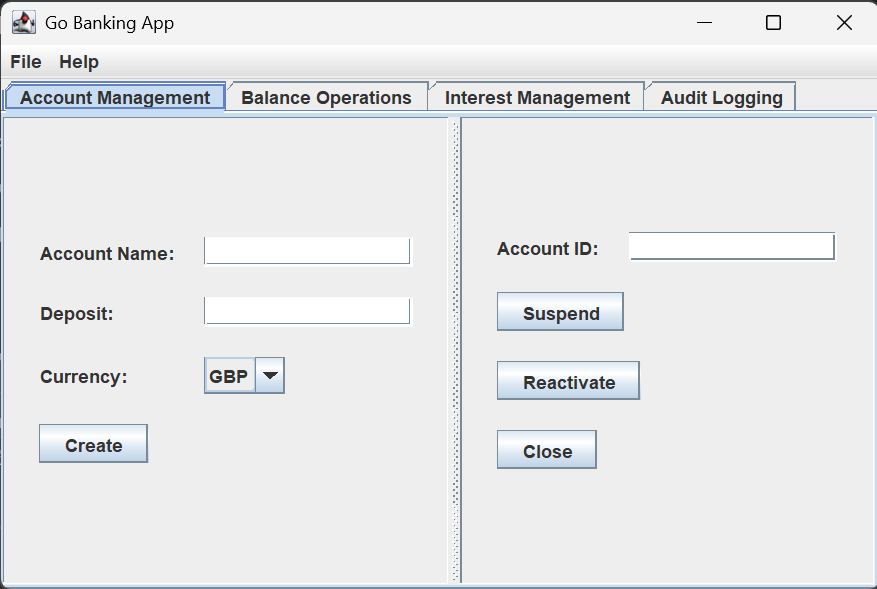
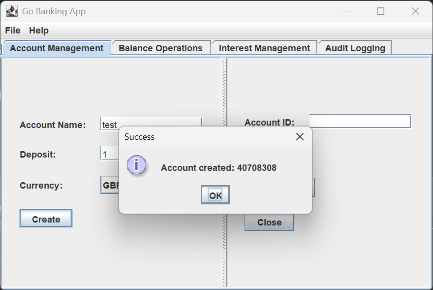
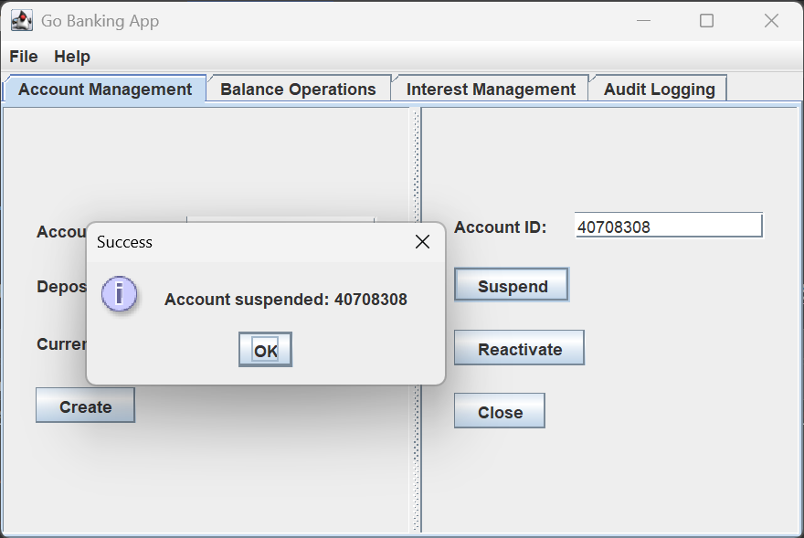
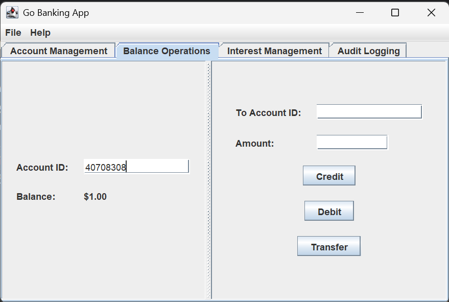
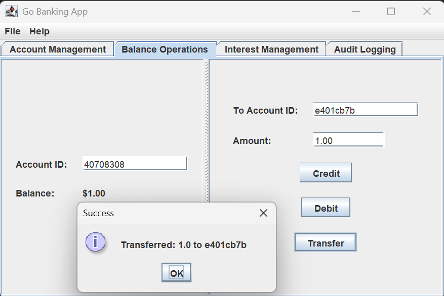
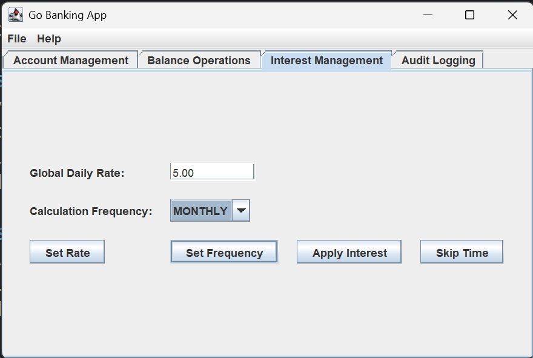
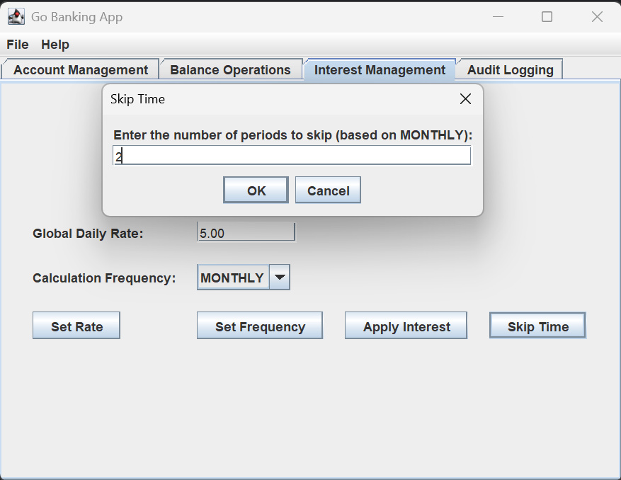
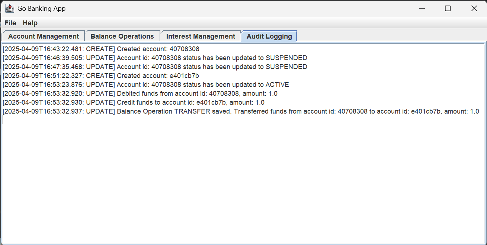
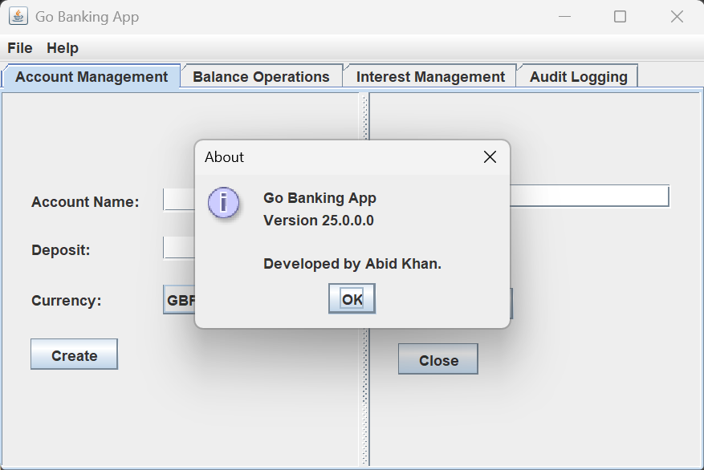

# Go Banking Application GUI User Guide

This guide provides an overview of how to use the Go Banking Application desktop interface, built with Java Swing. The GUI allows you to manage accounts, perform balance operations, configure interest settings, and view audit logs. Follow the steps below to navigate and use the application effectively.

---

## 📌 Table of Contents
- [Launching the Application](#launching-the-application)
- [Main Interface Overview](#main-interface-overview)
- [Using the Tabs](#using-the-tabs)
- [Account Management](#account-management)
- [Balance Operations](#balance-operations)
- [Interest Management](#interest-management)
- [Audit Logging](#audit-logging)
- [Menu Options](#menu-options)
- [Troubleshooting](#troubleshooting)

---

## 🚀 Launching the Application

1. Prerequisites:
    - Download the release.zip from the releases in the github.
    - Extract the zip.
    - Ideally run on a windows system as the release folder contains windows scripts.
2. Run the Application:
    - Execute the `run.bat` batch file. This will automatically create all required folders and start every server and ultimately start the swing ui.
    - The GUI will open in a window titled "Go Banking App" (configurable via service.properties).
3. (Optional) Every server and the swing ui itself has a properties file under config folder of the respective project `service.properties` which allows you to configure each individual server and the ui.

---

## 🧾 Main Interface Overview

The main window features a tabbed interface with four sections:
- 🏦 **Account Management:** Create and manage accounts.
- 💰 **Balance Operations:** Handle credits, debits, and transfers.
- 📈 **Interest Management:** Configure and apply interest settings.
- 📝 **Audit Logging:** View system logs.

A menu bar at the top provides additional options.

- _Description_: Shows the initial window with the four tabs and "File" and "Help" menus visible.

---

### 🗂️ Using the Tabs

---

#### 🏦 Account Management
This tab allows you to create new accounts and manage existing ones (suspend, reactivate, or close).

##### Create an Account
1. Navigate to the "Account Management" tab.
2. On the left panel:
    - Enter an **Account Name** (e.g., "John Doe").
    - Enter an initial **Deposit** amount (e.g., "100.50").
    - Select a **Currency** from the dropdown (GBP, EUR, or JPY).
3. Click the **Create** button.
4. A dialog will confirm the account creation with its unique `accountId` (e.g., "afb56d39").

- _Description_: Left panel filled with "test", "1", and "GBP" selected, with the "Create" button highlighted.

##### Manage an Existing Account
1. On the right panel:
    - Enter the **Account ID** of an existing account (e.g., "0090eb02").
2. Click one of the following buttons:
    - **Suspend:** Suspends the account.
    - **Reactivate:** Reactivates a suspended account.
    - **Close:** Closes the account.
3. A dialog will confirm the action with the `accountId`.

- _Description_: Right panel with "40708308" in the Account ID field and the "Suspend" button highlighted.

---

#### 💰 Balance Operations

This tab lets you check balances and perform transactions (credit, debit, transfer).

##### Check Balance
1. Navigate to the "Balance Operations" tab.
2. In the left panel, enter an **Account ID** (e.g., "0090eb02").
3. Move focus away (e.g., click elsewhere or press Tab).
4. The **Balance** label updates with the current balance (e.g., "$100.50").

- _Description_: Left panel with "40708308" entered and "Balance: $1.00" displayed.

##### Perform Transactions
1. In the right panel:
    - Enter the **To Account ID** (for transfers only, e.g., "7cd78caa").
    - Enter the **Amount** (e.g., "50.25").
2. Click one of the following buttons:
    - **Credit:** Deposits the amount into the account.
    - **Debit:** Withdraws the amount from the account.
    - **Transfer:** Transfers the amount to the "To Account ID".
3. A dialog confirms the transaction with details (e.g., amount and timestamp).

- _Description_: Right panel with "e401cb7b" in "To Account ID", "1.00" in "Amount", and "Transfer" button highlighted.

---

#### 📈 Interest Management

This tab configures and applies interest settings across accounts.

##### Set Interest Rate
1. Navigate to the "Interest Management" tab.
2. Enter a **Global Daily Rate** (e.g., "5.00" for 5%).
3. Click **Set Rate**.
4. A dialog confirms the new rate.

##### Set Calculation Frequency
1. Select a **Calculation Frequency** from the dropdown (DAILY, WEEKLY, MONTHLY).
2. Click **Set Frequency**.
3. A dialog confirms the new frequency.

- _Description_: "5.00" in the rate field, "MONTHLY" selected, with "Set Rate" and "Set Frequency" buttons visible.

##### Apply Interest
1. Click **Apply Interest**.
2. A confirmation dialog asks if you want to force-apply interest to all accounts.
3. Select **Yes** to apply immediately; a success dialog appears.

##### Skip Time
1. Click **Skip Time**.
2. Enter the number of periods to skip (e.g., "2") in the input dialog.
3. Click **OK**. The system simulates skipping the specified periods based on the current frequency (e.g., 2 months if MONTHLY).
4. A dialog confirms the action.

- _Description_: Dialog open with "Enter the number of periods to skip (based on MONTHLY):" and "2" entered.

---

#### 📝 Audit Logging

This tab displays real-time logs of all operations.
- Logs are polled every 5 seconds (configurable in `service.properties`).
- The text area shows entries like `[2025-04-09T13:29:14.693: CREATE] Created account: 24a766e4.`
- If the audit service is offline, a warning appears (e.g., "[WARNING] Audit logging service is offline").

- _Description_: Text area with sample log entries, scrolled to the bottom.

---

### 🍔 Menu Options

- File > Exit: Closes the application cleanly.
- Help > About: Displays version and author info ("Go Banking App, Version 0.0.1-SNAPSHOT, Developed by Abid Khan").

- Description: About dialog box open with version details.

---

### 🛠️ Troubleshooting

- **Error Messages**: If an action fails (e.g., invalid input), an error dialog appears (e.g., "Invalid Input: Please enter a valid deposit amount").
- ***Service Offline**: If a service (e.g., audit logging) is unavailable, check the console or logs (`logs/service.log`) for details.
- **Balance Not Updating**: Ensure the Account ID is correct and the backend service is running at `http://localhost:8000` (configurable in `service.properties`).
